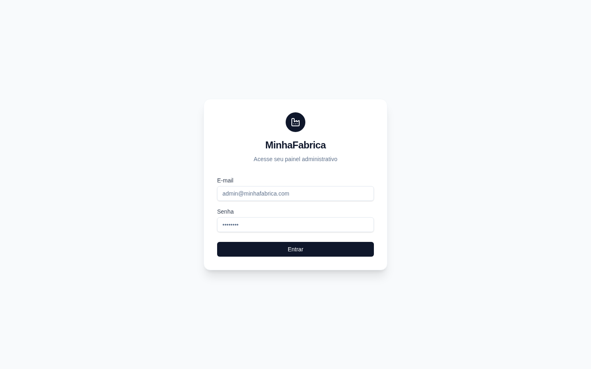
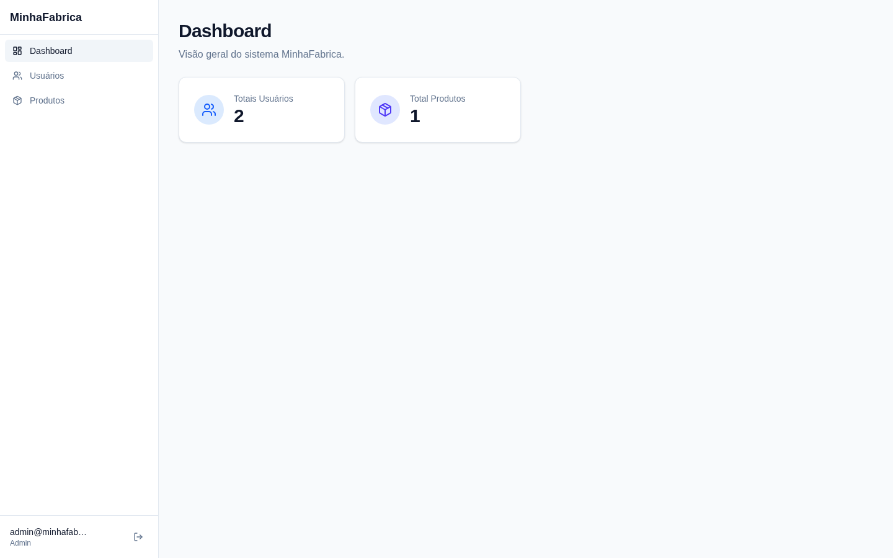
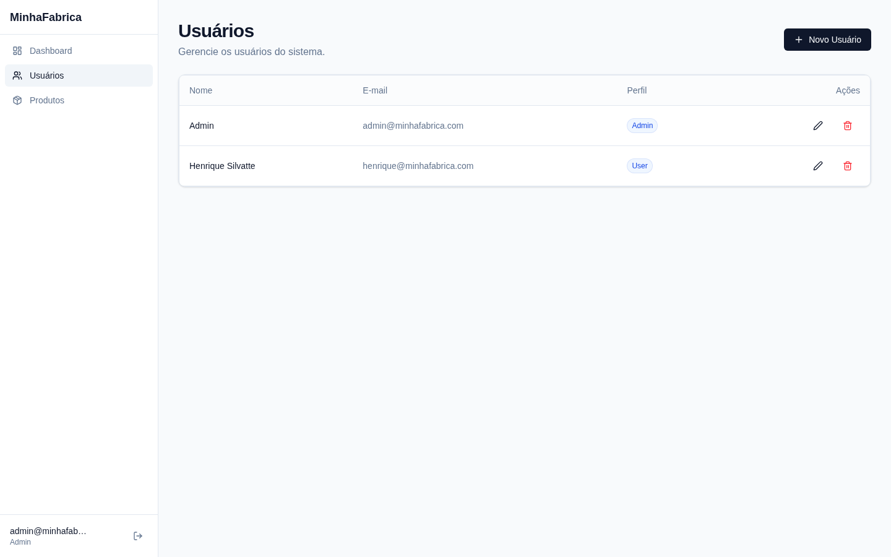
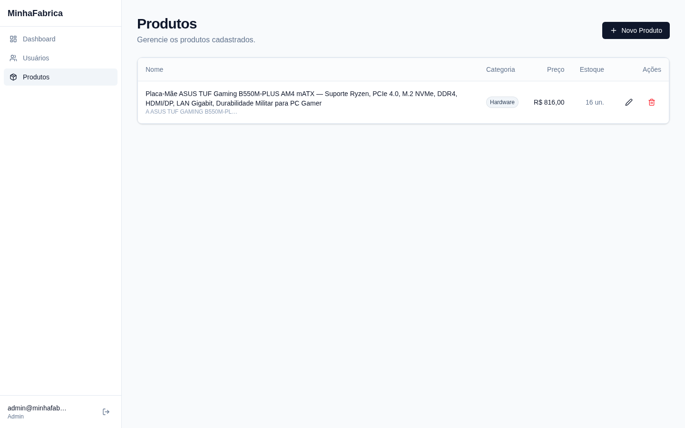

# 🏭 MinhaFabrica — Desafio Técnico

> *"Uma solução fullstack focada em arquitetura limpa, segurança e experiência do usuário."*

---

👋 Olá! Esse repositório é a minha entrega oficial para o desafio técnico do processo seletivo da **MinhaFabrica**.

Mais do que apenas cumprir requisitos, enxerguei este projeto como uma oportunidade de demonstrar a minha visão de como um software deve ser construído para a vida real: **organizado, seguro, escalável e pronto para produção.**

O resultado é um painel administrativo com gestão de usuários e produtos, construído sobre uma API REST robusta e uma interface web fluida e moderna, com autenticação via JWT e um CRUD completo para as duas entidades.

---

## 🚀 Acesse a Aplicação (Deploy)

Preparei um ambiente de produção real para facilitar a avaliação da aplicação rodando na prática. A API foi hospedada na Render e o Frontend na Vercel.

**🔗 Link de acesso:** [Acessar a Aplicação](https://minhafabrica-desafio-tecnico.vercel.app/login)

> ⚠️ **Nota Importante:** Como as instâncias do Backend no Render dormem após 15 minutos sem uso (plano gratuito), a **primeira requisição/login pode demorar em torno de 30 a 50 segundos** (processo conhecido como *Cold Start*). Após ele acordar, a navegação fica instantânea!

**Credenciais Admin para Teste:**
* **E-mail:** `admin@minhafabrica.com`
* **Senha:** `senha123`

---

## 📸 Uma Espiada no Sistema

Substitua estes espaços com os prints do seu projeto em funcionamento para o recrutador ver a "cara" do projeto de primeira.
*(Crie uma pasta chamada `docs` na raiz do projeto, jogue as imagens lá dentro e atualize os nomes ou caminhos)*

<div align="center">
  
  
  <br>
  
  
</div>

---

## 🛠️ Tecnologias Escolhidas

**Backend:** Node.js + Express 5 + MongoDB (Mongoose 9) + TypeScript  
**Frontend:** Next.js 16 + React 19 + TypeScript + Tailwind CSS v4  
**Segurança:** Autenticação via JWT, Rate Limiting, Helmet e CORS  

Escolhi essa stack tecnológica porque ela me permite extrair a máxima performance e manutenção sem introduzir *over-engineering* complexo. É simples, eficiente e atende majestosamente ao escopo do desafio.

---

## 🏗️ Como a Arquitetura foi Pensada

O backend não é apenas um script gigante; ele segue rigorosamente o padrão **Controller → Service → Repository → Model**. 
Gosto profundamente dessa separação porque deixa o código maduro:
* **Controller:** Somente recebe a requisição e devolve a resposta HTTP.
* **Service:** Abrigam todas as regras de negócio de forma isolada.
* **Repository:** A única camada autorizada a conversar/fazer queries com o Banco de Dados.

Isso facilita a criação de testes de unidade e poupa muitas horas de dor de cabeça caso precisemos escalar o projeto no futuro.

---

## 💻 Para Rodar Localmente

Caso queira baixar e avaliar o código fonte rodando na sua máquina:

Você vai precisar de Node.js (>= 18) e uma conexão com o MongoDB (Local ou Atlas).

### 1. Subindo a API (Backend)
```bash
cd backend
npm install
cp .env.example .env
# Configure sua URI do MongoDB e um JWT_SECRET dentro de .env
npm run dev
```
A API responde por padrão em `http://localhost:3001/api/v1`.

*Obs: Para criar o Admin inicial, envie um POST via Postman, Insomnia ou cURL para `http://localhost:3001/api/v1/auth/seed` com o backend rodando.*

### 2. Subindo a Interface (Frontend)
```bash
cd frontend
npm install
npm run dev
```
A Aplicação Web levanta em `http://localhost:3000`.

---

Qualquer dúvida sobre o projeto, sobre o código ou sobre as decisões técnicas que tomei, estou totalmente à disposição! Muito obrigado pela oportunidade.
